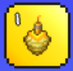

# Bee Bomb
Bee Bomb mod for Terraria

	

Adds a Bee Bomb (alternately a "Beenamite"), which is an enhanced Beenade.

	

The Bee Bomb sticks to tiles like a Sticky Bomb, and when it explodes, it does 150 damage and releases 35-45 Bees.
If wearing the Hive Pack, more powerful Bees will be released.

	

Anyone caught in the blast will be Honey'd and have their movement extremely reduced.

	

The Bee Bomb does not destroy tiles.
Warning: The bomb will stick to platforms rather than pass through them.

Adds a crafting recipe for the Bee Bomb: 5 Hive and 1 Dynamite (Note: to be changed to 1 Bee Hive and 1 Dynamite in Terraria 1.4).

	

Also adds a Bee House workbench.

	

The Bee House allows you to convert Dayblooms into Hive.

	

The Bee House is sold by the Witch Doctor in the Jungle for 6 gp after the Queen Bee is defeated.

	

